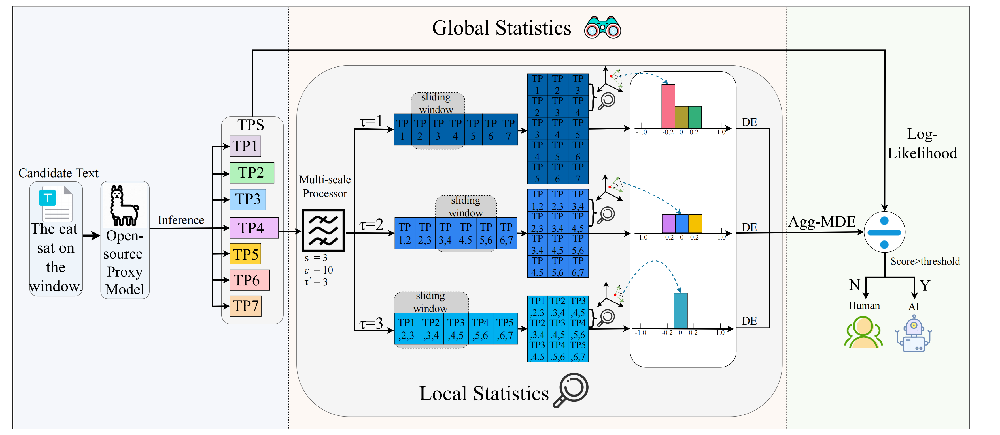

# Training-free LLM-generated Text Detection by Mining Token Probability Sequences

This project provides the core code for the two main methods, **Lastde and Lastde++** , as presented in our [paper](https://openreview.net/forum?id=vo4AHjowKi&referrer=%5BAuthor%20Console%5D(%2Fgroup%3Fid%3DICLR.cc%2F2025%2FConference%2FAuthors%23your-submissions)).

We follow the standard testing procedures outlined in [Fast-DetectGPT](https://github.com/baoguangsheng/fast-detect-gpt/tree/main) to evaluate each detection method.


<p align="center">
></a> <br>
</p>

# Environment

- Python3.8
- Pytorch2.0.0
- Other dependencies:
  ```python
  pip install -r requirements.txt
  ```
  (Note: Our experiments were conducted on two RTX 3090 GPUs with 24GB of memory each.)

# Source Models and Proxy Models

The `pretrain_models` directory is used to store open-source models, including those used as proxies or for generating text produced by LLMs. Here, we take `gpt-j-6b` and `Llama-3-8B` as examples, and the model weights can be downloaded from the following addresses:
- [gpt-j-6b](https://huggingface.co/EleutherAI/gpt-j-6b/tree/main)
- [Llama-3-8B](https://huggingface.co/meta-llama/Meta-Llama-3-8B/tree/main)

# Datasets

The main dataset is divided into two parts:
- The `human_original_data` directory contains raw text in json format, with the Xsum dataset (i.e., **xsum.json**) as an example.
- The `human_llm_data_for_experiment` directory stores the complete data used for experiments, with **xsum_llama3_8b.raw_data.json** as an example. This dataset needs to be obtained by running 
    ```python
    python py_scripts/data_generations/data_generation_opensource.py
    ```
    (Note : We have already provided the data here, so there is no need to run) Each complete data entry contains two parts: 'original' (human-written text) and 'sampled' (LLM-generated text), with the content of the two types of text corresponding to each other. The 'sampled' text is generated by using the first 30 tokens of the corresponding 'original' text as prompt input to the source model (in this case, Llama-3-8B) for continuation, and all entries are truncated to the same length.
- The `perturbation_data_detectgpt_npr` and `regeneration_data_dnagpt` directories store the complete data of the DetectGPT/DetectNPR and DNA-GPT detection experiments respectively.
- The remaining directories correspond to the robustness section in our paper.


# Detection

Running **detection_white_box.sh** or **detection_black_box.sh** in `shell_scripts` will trigger white-box and black-box detection, respectively.
```shell
cd shell_scripts

# white-box setting
./detection_white_box.sh 

# black-box setting
./detection_black_box.sh
```

The detection methods include:
- Likelihood, LogRank, Entropy, DetectLRR, **Lastde(ours)**. Results will be saved in `experiment_results/statistic_detection_results`.
- DetectGPT. Results will be saved in `experiment_results/detectgpt_detection_results`.
- DetectNPR. Results will be saved in `experiment_results/npr_detection_results`.
- DNA-GPT. Results will be saved in `experiment_results/dna_gpt_detection_results`.
- Fast-DetectGPT. Results will be saved in `experiment_results/fast_detectgpt_detection_results`.
- **Lastde++(ours)**. Results will be saved in `experiment_results/lastde_doubleplus_detection_results`.

The code for the above detection methods is encapsulated in `py_scripts/baselines`.

Other experimental scripts are located in the `shell_scripts` directory.

# Baselines
We provide the following baseline implementations.

- **sample-based methods:** Likelihood, LogRank, Entropy, DetectLRR, **Lastde(ours)**, Binoculars
- **Distribution-based methods:** DetectGPT, DetectNPR, DNA-GPT, Fast-DetectGPT, **Lastde++(ours)**
- **Plug and Play versions:** Likelihood_tocsin, LogRank_tocsin, DetectLRR_tocsin, Lastde_tocsin, Fast-DetectGPT_tocsin, Lastde++_tocsin
- **supervised-based methods:** RoBERTa_Base, RoBERTa_Large, ReMoDetect

We thank the authors of open source projects and models such as [Fast-DetectGPT](https://github.com/baoguangsheng/fast-detect-gpt/tree/main), [TOCSIN](https://github.com/Shixuan-Ma/TOCSIN), [ReMoDetect](https://github.com/hyunseoklee-ai/ReMoDetect) and [Binoculars](https://github.com/ahans30/Binoculars).

# Main results (AUROC)
## White-box 
- **Datasets** : XSum, SQuAD, WritingPrompts
- **Sampling || Scoring model** : specific source model || specific source model
- **Hyperparameters of Lastde/Lastde++** : 
  - Lastde: $s$ = 3, $\varepsilon=10\times n$, $\tau^{\prime}=5$, $Agg=Std$.
  - Lastde++: $s$ = 4, $\varepsilon=8\times n$, $\tau^{\prime}=10$, $Agg=Std$.

| Method         | GPT-2 | Neo-2.7 | OPT-2.7 | GPT-J | Llama-13 | Llama2-13 | Llama3-8 | OPT-13 | BLOOM-7.1 | Falcon-7 | Gemma-7 | Phi2-2.7 | Avg. |
|----------------|-------|---------|---------|--------|-----------|-------------|-----------|--------|------------|-----------|----------|-----------|------|
| Likelihood     | 91.65 | 89.40   | 88.08   | 84.95 | 63.65    | 65.36      | 98.35     | 84.45 | 88.00     | 76.78    | 70.14   | 89.67     | 82.54 |
| LogRank        | 94.31 | 92.87   | 90.99   | 88.68 | 68.87    | 70.27      | 99.04     | 87.74 | 92.42     | 81.32    | 74.81   | 92.13     | 86.12 |
| Entropy        | 52.15 | 51.72   | 50.46   | 54.31 | 64.18    | 61.05      | 23.30     | 54.30 | 62.67     | 59.33    | 66.47   | 44.09     | 53.67 |
| DetectLRR      | 96.67 | 96.07   | 93.13   | 92.24 | 81.40    | 80.89      | 98.94     | 91.03 | 96.35     | 87.45    | 81.36   | 94.10     | 90.80 |
| **Lastde**     | **98.41** | **98.64** | **98.15** | **97.24** | **88.98** | **88.40** | **99.71** | **96.47** | **99.35** | **95.49** | **91.85** | **96.99** | **95.89** |
| DetectGPT      | 93.43 | 90.40   | 90.36   | 83.82 | 63.78    | 65.39      | 70.13     | 85.05 | 89.28     | 77.98    | 68.96   | 89.55     | 80.68 |
| DetectNPR      | 95.77 | 94.77   | 93.24   | 88.86 | 68.60    | 69.83      | 95.55     | 89.78 | 94.95     | 83.06    | 74.74   | 93.06     | 86.85 |
| DNA-GPT        | 89.92 | 86.80   | 86.79   | 82.21 | 66.28    | 64.46      | 98.07     | 82.51 | 86.74     | 74.04    | 63.63   | 88.00     | 80.45 |
| Fast-DetectGPT | 99.57 | 99.49   | 98.78   | 98.95 | 93.45    | 93.34      | **99.91**     | 98.07 | 99.53     | 97.74    | 96.90   | 98.10     | 97.82 |
| **Lastde++**   | **99.76** | **99.87** | **99.46** | **99.52** | **96.58** | **96.67** | 99.82 | **98.77** | **99.84** | **98.76** | **98.40** | **98.76** | **98.85** |

## Black-box 
- **Datasets** : XSum, WritingPrompts, Reddit
- **Sampling || Scoring model** : 
  - **Sample-based methods** : None || [GPT-j-6B](https://huggingface.co/EleutherAI/gpt-j-6b/tree/main)
  - **Distribution-based methods** : [GPT-j-6B](https://huggingface.co/EleutherAI/gpt-j-6b/tree/main) || [GPT-j-6B](https://huggingface.co/EleutherAI/gpt-j-6b/tree/main)
- **Hyperparameters of Lastde/Lastde++** : 
  - Lastde: $s$ = 3, $\varepsilon=10\times n$, $\tau^{\prime}=5$, $Agg=Std$.
  - Lastde++: $s$ = 4, $\varepsilon=8\times n$, $\tau^{\prime}=10$, $Agg=Std$.

| Method         | GPT-2 | Neo-2.7 | OPT-2.7 | Llama-13 | Llama2-13 | Llama3-8 | OPT-13 | BLOOM-7.1 | Falcon-7 | Gemma-7 | Phi2-2.7 | GPT-4-Turbo | Avg. |
|----------------|-------|---------|---------|-----------|-------------|-----------|--------|------------|-----------|----------|-----------|---------------|------|
| Likelihood     | 65.88 | 67.09   | 67.40   | 65.75    | 68.61      | 99.60     | 68.80  | 61.80     | 67.42    | 69.90   | 73.93     | 79.69         | 71.32 |
| LogRank        | 70.38 | 71.17   | 72.35   | 70.28    | 72.67      | **99.69**     | 73.01  | 67.51     | 71.66    | 72.17   | 77.99     | 79.24         | 74.84 |
| Entropy        | 61.48 | 58.65   | 54.55   | 49.14    | 45.18      | 14.43     | 53.09  | 60.84     | 50.55    | 48.01   | 46.58     | 35.09         | 48.13 |
| DetectLRR      | 79.30 | 79.19   | 81.25   | 78.51    | 78.94      | 97.35     | 80.27  | 79.57     | 79.87    | 73.47   | 83.79     | 73.85         | 80.45 |
| **Lastde**     | **89.17** | **90.24** | **89.70** | **80.71** | **79.90** | 99.67 | **90.01** | **88.94** | **84.36** | **79.61** | **88.32** | **81.33**       | **86.38** |
| DetectGPT      | 67.56 | 69.28   | 72.03   | 66.12    | 67.96      | 82.90     | 73.89  | 61.83     | 68.69    | 66.55   | 72.76     | 81.73         | 70.94 |
| DetectNPR      | 68.07 | 68.41   | 73.06   | 67.83    | 70.60      | 96.75     | 75.13  | 63.00     | 70.42    | 65.72   | 74.08     | 79.94         | 72.75 |
| DNA-GPT        | 64.15 | 62.63   | 63.64   | 60.77    | 66.71      | 99.47     | 65.75  | 62.01     | 65.08    | 62.59   | 72.02     | 70.75         | 67.97 |
| Fast-DetectGPT | 89.82 | 88.75   | 86.52   | 77.58    | 77.62      | 99.43     | 86.16  | 84.55     | 81.42    | 81.49   | 86.67     | 88.18         | 85.68 |
| **Lastde++**   | **94.93** | **95.28** | **94.13** | **85.00** | **85.80** | 99.03 | **93.37** | **92.22** | **89.49** | **87.58** | **92.67** | **88.21**       | **91.47** |

## GPT-4-Turbo || GPT-4o || Claude-3-Haiku (Black-box)
- **Sampling || Scoring model** : 
  - **Sample-based methods** : None || [GPT-j-6B](https://huggingface.co/EleutherAI/gpt-j-6b/tree/main)
  - **Distribution-based methods** : [GPT-j-6B](https://huggingface.co/EleutherAI/gpt-j-6b/tree/main) || [GPT-j-6B](https://huggingface.co/EleutherAI/gpt-j-6b/tree/main)
- **Hyperparameters of Lastde/Lastde++** : 
  - Lastde: $s$ = 3, $\varepsilon=1\times n$, $\tau^{\prime}=15$.
  - Lastde++: $s$ = 4, $\varepsilon=8\times n$, $\tau^{\prime}=10$.

| Source Models ($\rightarrow$)                     |  |  GPT-4-Turbo |         |       |      | GPT-4o  |       |       |  | Claude-3-haiku  |       |       |
|---------------------------|-------------|------|---------|-------|------------|------|-------|-------|----------------|------|-------|-------|
|                           | XSum        | WritingPrompts   | Reddit  | Avg.  | XSum       | WritingPrompts   | Reddit| Avg.  | XSum           | WritingPrompts   | Reddit| Avg.  |
| Likelihood                | 60.44       | 81.48| 97.15   | 79.69 | **75.42**       | 84.90| 97.74 | **86.02** | 96.84          | 98.38| 99.92 | 98.38 |
| LogRank                   | 61.52       | 79.03| **97.16**   | 79.24 | 73.85       | 82.32| 97.74 | 84.64 | 97.09          | 98.71| 99.96 | 98.59 |
| Entropy                   | 61.24       | 35.56| 08.48   | 35.09 | 47.50       | 31.60| 09.74 | 29.61 | 38.90          | 17.69| 06.56 | 21.05 |
| DetectLRR                 | 61.71       | 66.75| 93.10   | 73.85 | 62.87       | 69.06| 93.75 | 75.23 | 95.78          | 97.96| 99.56 | 97.77 |
| **Lastde(Std)**           | **64.16**   | **83.09** | 96.74 | **81.33** | 73.87 | **86.20** | **97.74** | 85.94 | **97.44** | **99.40** | 99.92 | **98.92** |
| Fast-DetectGPT            | 80.79       | **89.88**| 93.87   | 88.18 | 86.87       | 93.77| 97.93 | 92.86 | 99.93          | 99.99| 99.96 | 99.96 |
| Lastde++(2-Norm)          | 76.91       | 87.39| 93.61   | 85.97 | 85.74       | 92.96| 97.52 | 92.07 | 99.95          | 99.99| 99.96 | 99.97 |
| Lastde++(Range)           | 82.67       | 86.37| 91.72   | 86.92 | 85.96       | 91.34| 96.57 | 91.29 | 99.84          | 99.99| 99.96 | 99.93 |
| Lastde++(Std)             | **83.12**       | 88.50| 93.00   | 88.21 | 86.47       | 93.41| 96.98 | 92.29 | 99.92          | 99.96| 99.89 | 99.92 |
| **Lastde++(ExpRange)**    | 82.40   | 89.02 | 93.70 | 88.37 | **87.42** | 93.60 | 97.77 | 92.93| 99.96 | **100** | **99.97** | **99.98** |
| **Lastde++(ExpStd)**      | 81.55   | 89.81 | **93.99** | **88.45** | 87.24 | **94.24** | **97.94** | **93.14** | **99.97** | 99.99 | 99.95 | 99.97 |

# Notes
- Currently, we recommend that you set the aggregate function (`Agg`) to `ExpStd`.

# Citation
If you find this work useful, you can cite it with the following BibTex entry:
```markdown
@articles{
  xu2025trainingfree,
  title={Training-free {LLM}-generated Text Detection by Mining Token Probability Sequences},
  author={Yihuai Xu and Yongwei Wang and Yifei Bi and Huangsen Cao and Zhouhan Lin and Yu Zhao and Fei Wu},
  booktitle={The Thirteenth International Conference on Learning Representations},
  year={2025},
}
```
